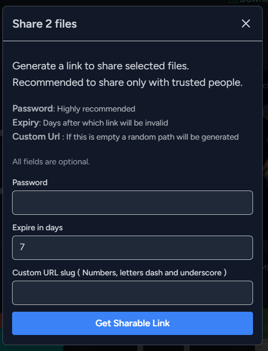

<p align="center">
  
 <h2 align="center">PERSONAL DRIVE</h2>
 <p align="center">A self hosted alternative to google drive and dropbox. 
</p>


## Requirements:
- A server running PHP with sqlite, nodejs, npm.
- sudo password to set permissions.
- Name of webserver user, if its not www-data 
- Files to upload
- Friends to share uploaded files

### Installation:
Installation of this laravel application should be straightforward. However it will be important to configure your PHP and webserver to allow larger uploads.   
**It is vital that the 'storage, bootstrap/cache and database' folders are writable for the webserver** . The setup.ssh script tries to change these permissions.

##### Commands: Clones the repo and runs the guided setup script.
```bash
 git clone git@github.com:gyaaniguy/personal-drive.git
 cd personal-drive
 chmod +x setup.sh
 ./setup.sh
```
 
Next :
- Setup your webserver server to point your site to personal-drive/public
- Open site. Follow the on-screen wizard to create admin account and setup storage folder


### Configuration:
- Storage folder can be changed from 'Settings'
- increasing upload limits is vital and will depend on the server type and web server app - apache, nginx, caddy. Detailed instructions are present on the 'settings' page after app installation.
- Increasing PHP, php-fpm memory limits is also important.
- We need write permissions to following folder:
```bash
storage
bootstrap/cache
database
```
The setup.sh script handles changing permissions and owner if root password is provided 


### Features:  

- Share files:
  - password protect
  - set expiry 
  - set custom url
  - A sharing control panel, to pause and delete existing shares
- Media player. Slideshow:
  - Play and view images and videos
  - Preview text and pdf files
  - Keyboard shortcuts available during slideshow . Left, right, escape
- Files are indexed
- Dynamically generated thumbnails
- Upload multiple files or folder at one go ! Folders are uploaded recursively
- Ability to Select one or all files in a folder
- Download, delete, share selected files.
- 2 layouts. list view and tile view 
- Fast sort, even for thousands of files
- Breadcrumb view

### Development:
Project has been developed in Laravel 11 and react. Used inertia.js to tie together react components with the laravel backend. Sqlite Database
PHP code follows psr-12 standard

### Security: 
Password cannot be changed. This is done to reduce attack surface. If you forget your password, reinstall the app. Your files will be safe on your disk

### Known Issues:
- Files are overwritten without giving an option to rename existing files

### Todo:
- Drag and Drag Upload
- Rename Functionality

### Screenshots:

<p align="center">
  
 <h2 align="center">PERSONAL DRIVE</h2>
 <p align="center">A self hosted alternative to google drive and dropbox. 
</p>
